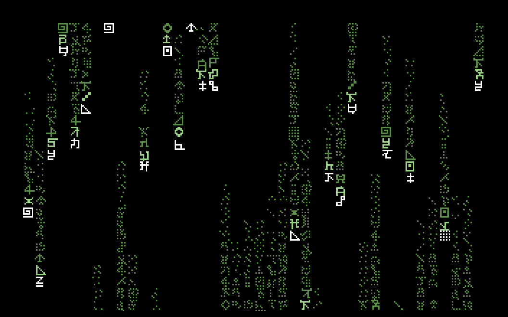
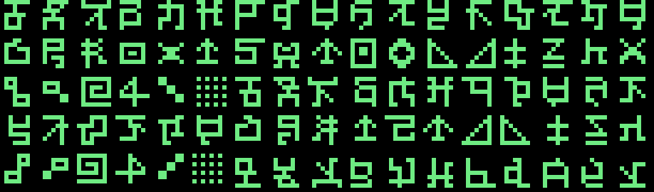

# Matrix Rain for the Commodore 64

Falling-code screen saver for a stock C64. 2.3 KB, PAL or NTSC, no cartridge,
no fastloader, no lag — the whole animation costs about 14% of a frame.



Press any key to exit. It puts the screen, the colours, the character set and
the SID back the way BASIC likes them on the way out.

## Quick start

Drop `dist/matrix.d64` on a C64 emulator (VICE, for example) or a real drive
and:

```
LOAD"MATRIX",8,1
RUN
```

The disk holds five builds:

| File            | What it is                                        |
|-----------------|---------------------------------------------------|
| `MATRIX`        | the default: original glyph set, green, with music |
| `MATRIX-SILENT` | the same, no music                                 |
| `MATRIX-AMBER`  | amber phosphor palette                             |
| `MATRIX-ICE`    | cold blue palette                                  |
| `MATRIX-ROM`    | letters and PETSCII graphics from the character ROM |

`dist/matrix-tune.mp3` is the music on its own, and `dist/tune.sid` is the
player as a standalone `.sid` file.

## How it works

Three things in here are worth reading the source for.

### Five brightness steps out of two greens

The VIC-II has exactly two greens, so a smooth fade down a trail cannot come
from the colour nybble. It comes from the **glyph** instead. At boot the
program builds its own character set in RAM holding every glyph three times:
full, 50% dithered and 25% dithered. A dithered glyph lights fewer pixels, so
the same colour byte reads as a darker green.

| step | colour      | glyph      | ≈ luminance |
|------|-------------|------------|-------------|
| head | white       | full       | 100% |
| −1   | light green | full       | 76%  |
| −2   | green       | full       | 35%  |
| −3   | green       | 50% dither | 18%  |
| −¾   | green       | 25% dither | 9%   |
| tail | black       | —          | 0%   |

Because the three copies are equal-size blocks of 85 glyphs, dimming a cell is
just `char = char + 85` — one read-modify-write, no lookup.

### Nothing scrolls, nothing redraws

Each of the 40 columns tracks a head row and a trail length. When a column
steps down it touches exactly six screen cells: the head (new glyph, white),
three recolour/dim steps behind it, one dim step three quarters of the way
down the trail, and the tail cell, which is erased by writing black to colour
RAM rather than blanking the character. Everything in between was already set
and is never written again.

Row addresses come from a 25-entry lookup table, so there is no multiply, and
colour RAM is the same pointer with `$D4` added to the high byte, since
`$0400+n` and `$D800+n` differ only there.

The whole update runs in the lower border at raster line 250, so the picture
is never half-drawn.

### Randomness in software, so the third voice can sing



The rain used to pick its glyphs by reading `$D41B`, the SID voice 3
oscillator, running noise at full frequency. Four cycles for a random byte and
no state to keep — but it pinned that voice to the noise waveform for ever,
which left the music with two and a half voices.

It now builds a 256-entry table of glyph numbers at boot with a 16-bit LFSR,
stepped eight times per entry so neighbours are independent. Reading it costs
ten cycles: the operand of the `LDA` is its own walking pointer, so every call
site gets a separate stream through the table for nothing. The one-time cost
is about 27,000 cycles at boot; the per-frame cost is slightly *lower* than
the SID read was, because the table is pre-folded into glyph range.

That hands voice 3 to the music. The tune is 16 bars in D minor at 94 BPM,
looping every 41 seconds. It leans cinematic rather than chiptune — a slow
tempo, a descending lament bass (D–C–B♭–A, the A taken as a major dominant for
the bite of the C♯), a half-time kick and snare instead of a busy kit, and a
sawtooth bass riff carrying the whole thing.

Every note of that riff sits at or below the root — root, fifth below, flat
seventh below — so it never climbs out of the bass register, and it sustains
at full level between hits rather than decaying, which keeps the low end
continuous while still being an articulated line rather than a drone. Note
indices are based so that index 8 is C1: the bottom octave is usable and no
pitched note can collide with a drum code.

Three voices carry five parts:

| voice | part | and also |
|-------|------|----------|
| 1 | the bass riff — sawtooth, six notes a bar, 3+3+2 across it | never interrupted |
| 2 | bars 1–8: a triangle **sub layer** doubling the riff at full sustain — a near-pure fundamental under the sawtooth, the way a sine is layered under a synth bass. Bars 9–16: the off-beat ostinato | the kick, on the two steps a bar where both rest anyway |
| 3 | the upper line, slow attack with vibrato — it sits out the first four bars, so the piece opens on bass and drums alone | the snare on the backbeat |

The upper line re-swells after every snare, and that pulsing-strings effect is
the point rather than a compromise. The kick is a real drum — a triangle wave
swept from 300 Hz down to 45 Hz over eight frames with a long decay, so the
bottom of it booms — which is only possible because the voice is free to
change pitch again.

## Building

Needs [ACME](https://sourceforge.net/projects/acme-crossass/) and Python 3.

```sh
make            # every variant plus dist/matrix.d64
make verify     # run each build through a 6502 simulator
make checktune  # read back every note the player writes to the SID
make sid        # the tune as a standalone .sid
make audio      # render that to mp3 (needs sidplayfp and ffmpeg)
```

Build options can be set on the command line:

```sh
acme -I src -DPALETTE=1 -DMUSIC=0 -f cbm -o matrix.prg src/matrix.asm
```

| Option    | Values | Meaning |
|-----------|--------|---------|
| `PALETTE` | 0,1,2  | green / amber / ice |
| `FONT`    | 0,1    | character ROM glyphs / the built-in glyph set |
| `MUSIC`   | 0,1    | silent / with the tune |
| `MIRROR`  | 0,1    | `FONT=0` only: mirror the upper-case block |

Speed lives in one place — `spdtab` in `src/matrix.asm`, four frames-per-row
values picked at random per column. Scale all four to change the pace without
flattening the spread between columns.

## Verifying

There is no hardware in CI, so `make verify` runs each build in a 6502
simulator with an emulated character ROM and checks what the screen actually
contains after a few hundred frames:

- no holes in a trail
- exactly one white head per column, and it is the lowest lit cell
- brightness never increases as you walk up a trail
- no character code outside the three dither blocks
- the per-frame cycle budget, so a build can never miss a frame

The tune is checked the same way. `make checktune` runs the player in the
simulator, reads back every frequency it writes to the SID, and compares it
against what `tools/music.py` composed — so the generator, the assembled data
and the player are checked against each other end to end. That is far more
reliable than analysing the rendered audio: the ostinato's harmonics sit in
the same band as the upper line and will happily fool a spectrum peak into
reporting the wrong note.

`tools/measure.py` counts how many rows the rain actually advances per frame,
which is how the speed was tuned.

## Layout

```
src/matrix.asm      the program
src/fontdata.inc    85 glyphs, each drawn in a comment above its bytes
src/music.inc       the player
src/musicdata.inc   note tables and the three sequences
src/psid.asm        .sid wrapper for the tune
tools/mkfont.py     designs the glyph set, emits fontdata.inc
tools/music.py      composes the tune, emits musicdata.inc
tools/mkd64.py      writes a .d64 by hand (BAM, directory, linked sectors)
tools/sim.py        6502 simulator harness and the invariant checks
tools/fakerom.py    stand-in character ROM for the simulator
tools/sidtrace.py   reads back every note the player writes to the SID
tools/measure.py    measures the actual fall speed
```

## Originality

The glyphs and the music here are original work made for this project. The
falling-code look is a widely reproduced effect; this is not a copy of any
particular film's typeface or score, and the project is not affiliated with or
endorsed by any film or its rights holders.

Regenerate either from its generator with `make font` or `make music`.

## Licence

MIT — see [LICENSE](LICENSE).
